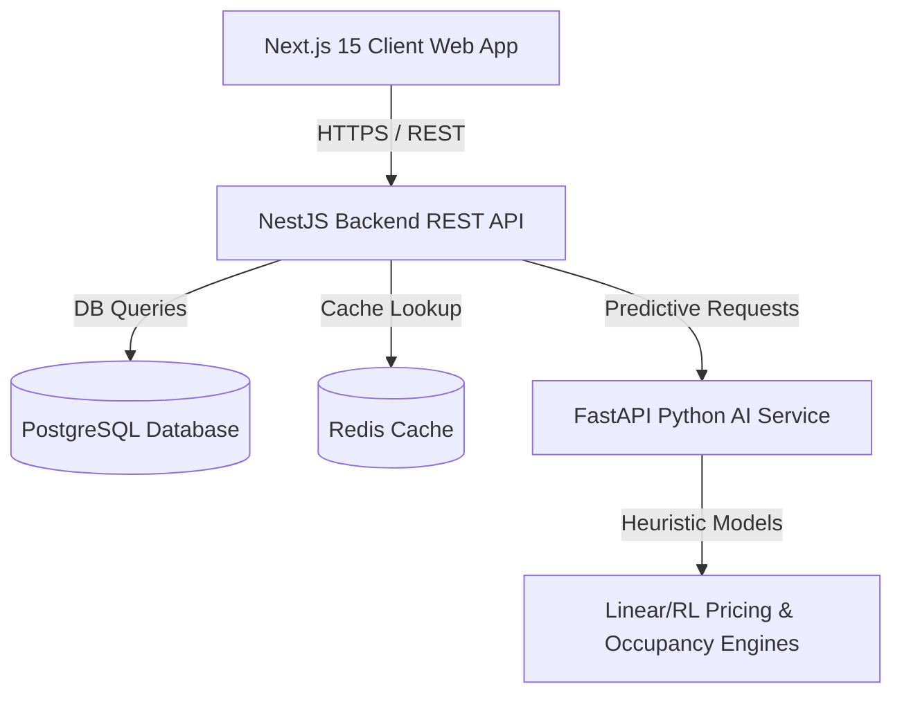

# SmartPark AI - Enterprise Smart City Parking SaaS Platform

SmartPark AI is a cloud-native, AI-powered Smart City Parking Management Platform. It enables drivers to locate, reserve, navigate, and pay for parking spaces in real-time, while providing parking operators and city authorities with dynamic surge pricing models, occupancy forecasting, and multi-tenant isolation.

---

## 🏗 System Architecture

The platform is designed as a modular cloud-native monorepo containing three core services:



### 1. Frontend Client (`/frontend`)
* Built with **Next.js 15 (App Router)** and **React 19**.
* Fully responsive luxury dark-mode theme styled with **Tailwind CSS**.
* Canvas2D dynamic 3D City simulation engine displaying vehicle entry/exit tracking in real-time.
* Global state management powered by **Zustand**.

### 2. Backend Rest API (`/backend`)
* Built with **Node.js NestJS** and **TypeScript**.
* Database modeling and transactions managed via **Prisma ORM**.
* Core parking modules: Auth (JWT + RBAC), Parking (slots/lots), Reservations (slot allocation transactions), and Payments (Stripe/Razorpay billing simulation).

### 3. AI Service (`/ai-service`)
* Built with **Python FastAPI**.
* Exposes prediction models for occupancy forecasting (LSTM simulations), dynamic price surge calculation, and sorting recommendations.

---

## 📦 Directory Structure

```text
Smart-parking-system-for-Smart-cities/
├── ai-service/
│   ├── main.py            # FastAPI entrypoint
│   ├── models.py          # Occupancy & Dynamic Pricing models
│   ├── Dockerfile         # Python slim build image
│   └── requirements.txt   # Python package dependencies
├── backend/
│   ├── src/
│   │   ├── auth/          # JWT strategy, Role guards, login REST endpoints
│   │   ├── parking/       # Lot coordinates & slot capacities
│   │   ├── reservation/   # Checks validation, transactions checkout
│   │   ├── payment/       # Stripe mock billing & invoice compiles
│   │   ├── main.ts        # Global validation pipes & CORS config
│   │   └── app.module.ts  # Modules registration imports
│   ├── prisma/
│   │   └── schema.prisma  # PostgreSQL relational models mapping
│   ├── Dockerfile         # Node alpine build image
│   └── package.json       # NestJS dependencies configuration
├── frontend/
│   ├── src/
│   │   ├── app/
│   │   │   ├── components/ # Glassmorphic top navigation & SmartCity canvas
│   │   │   ├── dashboard/  # Drivers portal, Operator metrics, Audit log grids
│   │   │   ├── globals.css # Dark theme neon glow declarations
│   │   │   ├── layout.tsx  # Root metadata & typography scripts
│   │   │   ├── page.tsx    # Interactive landing page and prices slider
│   │   │   └── store.ts    # Zustand global state
│   │   └── Dockerfile      # NextJS standalone node image
├── docker-compose.yml     # Multi-container orchestration config
└── README.md              # Technical specifications & guides
```

---

## 🛢 Relational Schema (Prisma Models)

The core entities configured inside `backend/prisma/schema.prisma` are:

1. **User**: Credentials, active roles (`SUPER_ADMIN`, `OPERATOR`, `DRIVER`, `CITY_AUTHORITY`).
2. **Vehicle**: Active license plates associated with users.
3. **ParkingLot**: Name, geo-coordinates, capacity size, and base pricing details.
4. **ParkingSlot**: Standard, EV charging, or Handicap status tracking.
5. **Reservation**: Time-locked reservation window, linked slot, and unique QR ticket token.
6. **Payment**: Invoice references, billing gateway details, and amount.
7. **Subscription**: SaaS tenancy plans (`FREE`, `STARTER`, `PROFESSIONAL`, `ENTERPRISE`).
8. **AuditLog**: Cryptographic trails for secure platform audits.

---

## 🚀 Local Deployment Guide

Deploy the entire production-ready system locally using Docker Compose:

### Prerequisites
* Docker Desktop installed and running.
* Ports `3000` (Frontend), `5000` (Backend), and `8000` (AI Service) must be free.

### Step 1: Start PostgreSQL, Redis, and Services
From the root directory, run:
```bash
docker-compose up --build -d
```

### Step 2: Database Migration & Seeding
The NestJS backend will automatically seed initial parking lots, standard users, and slots on initial startup. To verify or manually run migrations:
```bash
docker exec -it smartpark-backend npx prisma db push
```

### Step 3: Access Portals
* **Landing Page & Simulator**: `http://localhost:3000`
* **Backend REST API**: `http://localhost:5000`
* **AI Prediction Service**: `http://localhost:8000/docs` (interactive Swagger UI)

### Seeding Credentials for Demo Sandbox
Access the portals using the following pre-seeded credentials:
* **Super Admin**: `admin@smartpark.ai` (Password: `SmartPark2026!`)
* **Operator**: `operator@smartpark.ai` (Password: `SmartPark2026!`)
* **Driver**: `driver@smartpark.ai` (Password: `SmartPark2026!`)
* **Authority**: `authority@smartpark.ai` (Password: `SmartPark2026!`)
